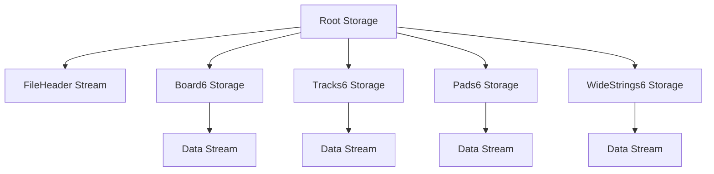

# Altium Binary PcbDoc Format: Overview

## Container Level

Altium `.PcbDoc` and `.PcbLib` files are not plain binary or text files, nor are they typical archives like ZIP. Instead, they use the **Microsoft Compound File Binary (CFB)** format, also known as OLE2 Structured Storage. This is the same container format traditionally used by older Microsoft Office documents (like `.doc` or `.xls`).

Because it uses the CFB format:
- The file acts like a miniature file system, containing a hierarchy of **Storages** (directories) and **Streams** (files).
- The file always starts with the well-known CFB magic bytes: `D0 CF 11 E0 A1 B1 1A E1`.
- Reading and writing the file requires a CFB parser (e.g., `olefile` in Python, `OpenMcdf` in C#, or `compoundfilereader` in C++).

## Top-Level Structure

When you open a `.PcbDoc` file using a CFB reader, you will find a specific directory structure. The root storage contains a series of named streams and sub-storages.

### `FileHeader` Stream

At the root of the CFB container, there is typically a `FileHeader` stream. This stream contains high-level format version information and identifiers. For example, it might contain a magic string identifying the Altium format version (like `PCB 6.0 Binary File`), followed by internal unique identifiers.

### Primitive Storages (The `*6` Pattern)

The bulk of the PCB design data is organized into top-level storages named after the types of primitives or logical groupings they contain. In modern Altium files (PCB version 6.0), these storages typically have a `6` appended to their names.

Common storages found at the root include:

- `Board6`: Board-level configuration, sheet position, and layer stackup.
- `Classes6`: Component, Net, and other design classes.
- `Rules6`: Design rules (Clearance, Width, Masks, Routing, etc.).
- `Nets6`: Net definitions.
- `Components6`: Component definitions and properties.
- `Arcs6`, `Pads6`, `Vias6`, `Tracks6`, `Texts6`, `Fills6`, `Regions6`, `Polygons6`: The actual geometric primitives on the PCB.
- `ComponentBodies6`: 3D body information for components.
- `WideStrings6`: A lookup table for UTF-16 strings (useful for text objects that require wide characters).
- `EmbeddedBoards6`: Data for embedded board arrays.
- `DifferentialPairs6`, `Rooms6`: Logical groupings for routing and placement.

### The `<StorageName>/Data` Stream Pattern

Altium heavily relies on a specific pattern within these storages. Inside almost every primitive storage (e.g., `Pads6`, `Tracks6`, `Board6`), you will find a stream named **`Data`**.

For example, the path to the pads data would be:
`Pads6/Data`

The `Data` stream contains the concatenated binary records for all objects of that type. To parse the file, a reader must iterate over the known storages, open the `Data` stream within each, and sequentially parse the records until the end of the stream is reached.

## Unrecognized Storages

Because Altium Designer is continually updated, new storages may appear in newer files. A robust parser should be aware of the "known" storages and safely ignore or preserve unknown storages/streams to maintain round-trip fidelity when resaving the document.
